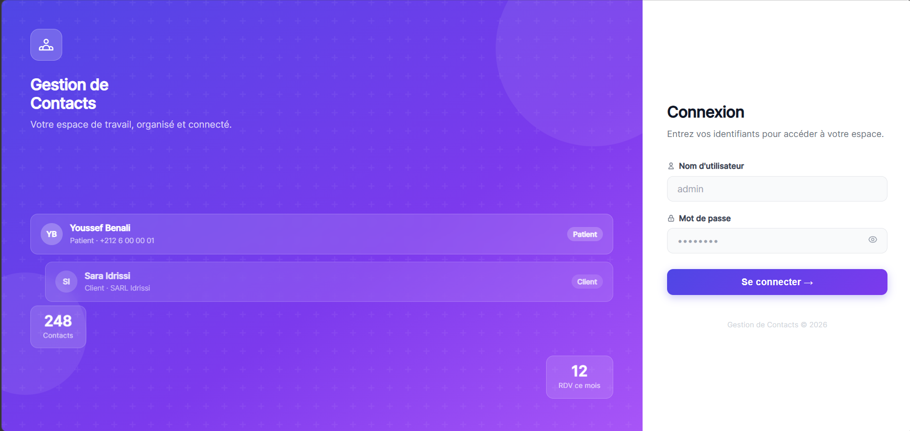
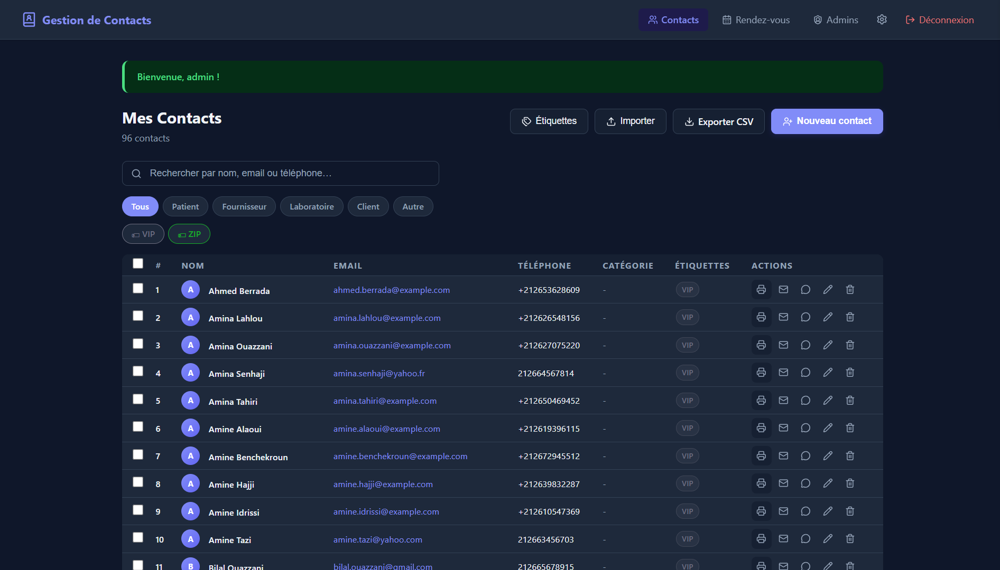
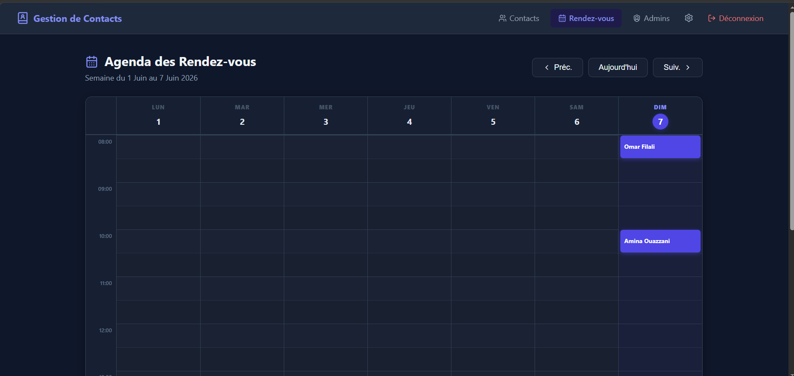

# 📇 Flask Contact Manager

A full-featured contact management web application built with **Flask** and **SQLite**, supporting contacts, appointments, labels, messaging (Email & WhatsApp), admin management, and a REST API.

---

## ✨ Features

- 🔐 **Authentication** — Secure login/logout with session management and bcrypt password hashing
- 👥 **Contact Management** — Add, edit, delete, search, and filter contacts by category or label
- 🏷️ **Labels** — Create custom labels and assign them to contacts
- 📅 **Appointments** — Book, cancel, and manage appointments with time-slot generation
- 📧 **Email Sending** — Send emails directly to contacts via Gmail SMTP
- 💬 **WhatsApp Messaging** — Send WhatsApp messages via the Twilio API
- 📥 **Import / Export** — Import contacts from CSV and export the full contact list
- 🖨️ **Print Contact Cards** — Generate printable contact profile pages
- 🗑️ **Bulk Delete** — Select and delete multiple contacts at once
- 🗓️ **Google Calendar Integration** — Connect your Google Calendar to sync appointments *(optional)*
- 🛡️ **Admin Panel** — Manage administrator accounts
- 📖 **REST API** — Full CRUD API for contacts, appointments, and labels
- 🎨 **Responsive UI** — Clean, responsive interface with a custom CSS stylesheet

---

## 🗂️ Project Structure

```
flask_contact/
├── app.py                    # Main Flask application & all routes
├── requirements.txt          # Python dependencies
├── contacts.db               # SQLite database (auto-created)
├── .env                      # Environment variables (not committed)
│
├── auth/
│   └── auth_manager.py       # Login verification logic
│
├── database/
│   └── db.py                 # DB connection, schema init & migrations
│
├── services/
│   ├── contact_service.py    # Contact CRUD & CSV import/export
│   ├── admin_service.py      # Admin account management
│   ├── appointment_service.py# Appointment booking & time-slot logic
│   ├── label_service.py      # Label creation & contact assignment
│   ├── message_service.py    # Email & WhatsApp sending
│   └── google_calendar_service.py # Google Calendar OAuth integration
│
├── templates/
│   ├── base.html             # Base layout with navbar
│   ├── login.html            # Login page
│   ├── contacts.html         # Main contacts list view
│   ├── appointments.html     # Appointments view
│   ├── admins.html           # Admin management page
│   ├── api_docs.html         # Interactive API documentation
│   └── ...
│
└── static/
    └── css/
        └── style.css         # Application stylesheet
```

---

## 🚀 Getting Started

### Prerequisites

- Python 3.9+
- pip

### Installation

1. **Clone the repository**
   ```bash
   git clone https://github.com/omarelhassani12/flask-contact-manager.git
   cd flask-contact-manager
   ```

2. **Install dependencies**
   ```bash
   pip install -r requirements.txt
   ```

3. **Configure environment variables**

   Create a `.env` file in the project root (or copy and edit the example):
   ```env
   # Email (Gmail SMTP)
   GMAIL_USER=your_email@gmail.com
   GMAIL_APP_PASSWORD=your_gmail_app_password

   # Twilio (WhatsApp)
   TWILIO_ACCOUNT_SID=your_twilio_sid
   TWILIO_AUTH_TOKEN=your_twilio_auth_token
   TWILIO_WHATSAPP_FROM=whatsapp:+14155238886

   # Google Calendar (optional)
   GOOGLE_CLIENT_ID=
   GOOGLE_CLIENT_SECRET=
   GOOGLE_REDIRECT_URI=http://localhost:5000/gcal/callback
   ```

4. **Run the application**
   ```bash
   python app.py
   ```

5. **Open in your browser**
   ```
   http://localhost:5000
   ```

   The database and a default admin account are created automatically on first run.

---

## 📸 Screenshots

| Login | Contacts | Appointments |
|-------|----------|--------------|
|  |  |  |

---

## 🌐 REST API

The application exposes a REST API at `/api/v1/`. Full interactive documentation is available at `/api-docs` when the app is running.

| Method | Endpoint | Description |
|--------|----------|-------------|
| `GET` | `/api/v1/contacts` | List all contacts |
| `GET` | `/api/v1/contacts/<id>` | Get a single contact |
| `POST` | `/api/v1/contacts` | Create a new contact |
| `PUT` | `/api/v1/contacts/<id>` | Update a contact |
| `DELETE` | `/api/v1/contacts/<id>` | Delete a contact |
| `GET` | `/api/v1/appointments` | List all appointments |
| `GET` | `/api/v1/labels` | List all labels |

---

## 🔧 Configuration & Integrations

### Gmail (Email Sending)
Generate a [Gmail App Password](https://myaccount.google.com/apppasswords) and set `GMAIL_USER` and `GMAIL_APP_PASSWORD` in your `.env`.

### Twilio (WhatsApp)
Sign up at [twilio.com](https://www.twilio.com), get your credentials, and fill in the `TWILIO_*` variables in `.env`.

### Google Calendar *(Optional)*
Create a project in [Google Cloud Console](https://console.cloud.google.com), enable the Google Calendar API, create OAuth 2.0 credentials, and set `GOOGLE_CLIENT_ID`, `GOOGLE_CLIENT_SECRET`, and `GOOGLE_REDIRECT_URI` in `.env`.

---

## 🛠️ Tech Stack

| Layer | Technology |
|-------|------------|
| Backend | Python 3, Flask |
| Database | SQLite (via `sqlite3`) |
| Auth | `bcrypt` |
| Spreadsheet I/O | `openpyxl` |
| Email | Gmail SMTP (`smtplib`) |
| WhatsApp | Twilio REST API |
| Calendar | Google Calendar API (OAuth 2.0) |
| Frontend | HTML5, CSS3, Jinja2 |

---

## 📄 License

This project is open source. Feel free to use, modify, and distribute it.

---
